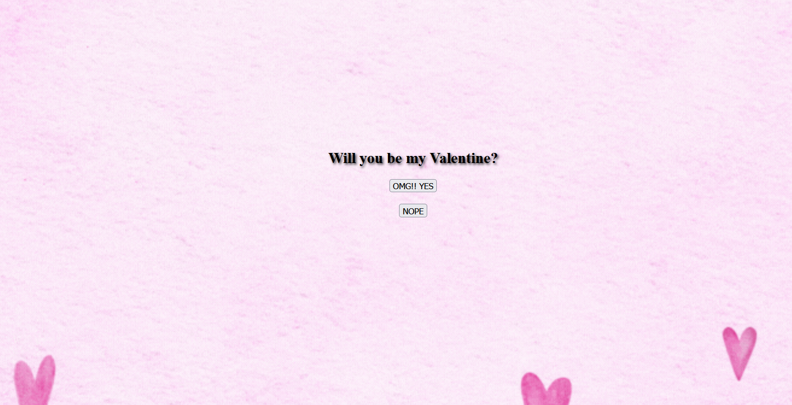
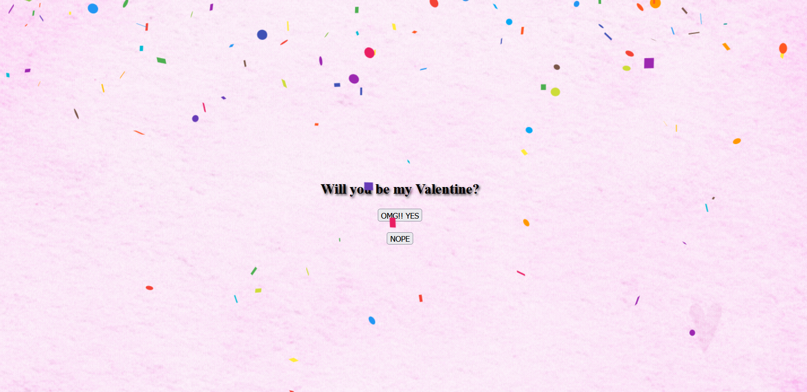

# How I asked my partner to be my valentine this year <3

* My girlfriend and I being software devs, I wanted to ask her to be my valentine in a unique way. So I made this

* Clicking on `Nope` would cancel out the confetti

### TRYING THE APP

* Clone this repository
* Run `cd be-my-valentine` and go to root 
* Run `npm run dev`
 - This generates a localhosted link to run the app